# Pokegram
## Description
Pokegram is a responsive website for people to share pictures and videos. Users can create an account and sign in to create their own posts, as well as leave comments or thumb up on posts. 
## Main Features
- Users may create an account, sign in or sign out with validation check.
- Once logged in, users may create their own posts with picture or video.
- Users may see the activities.
### Login
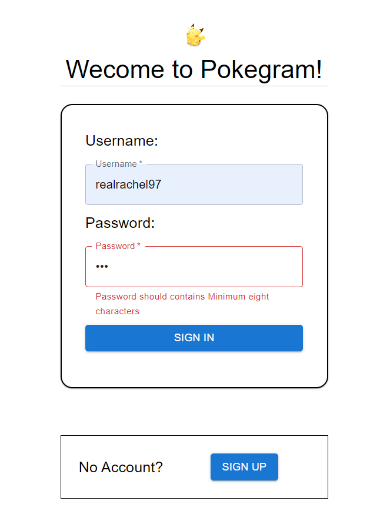
### SignUp
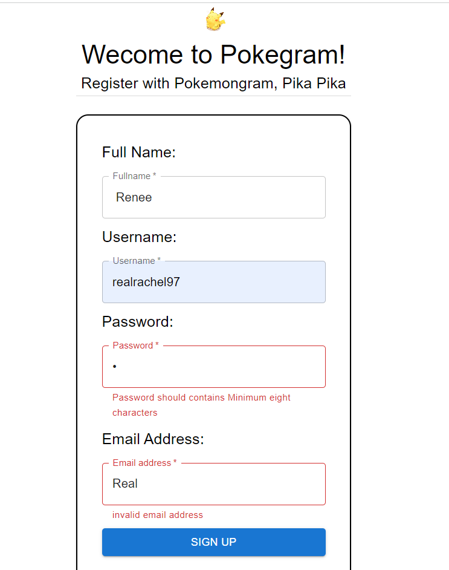
### Posts
This is the homepage and there is a menu bar on top, click `Pokegram` to return to home page, click upload to create a new post, click logout to return to login page, click activity to view activity feed, click avatar at the upper-right corner to view my profile page, click avatar of each post to view others' profile page.
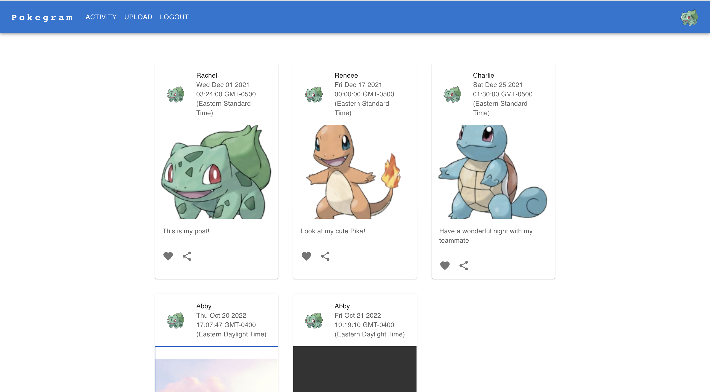
### Activities
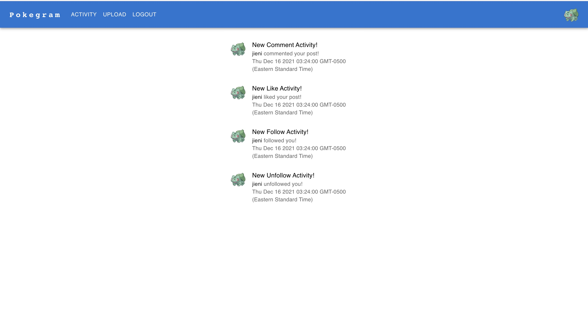
### Upload
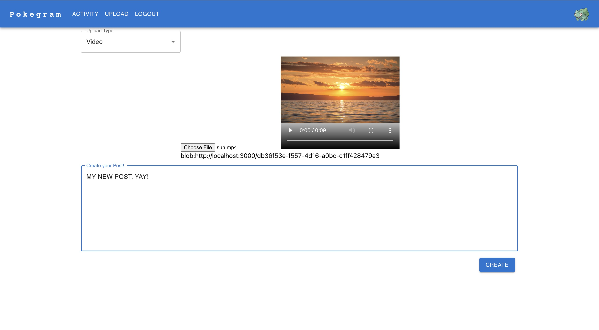
We allow click to choose between video and image, you can test by using image and video sources stored in ./pokegram/src/images and ./pokegram/src/videos
### like & unliking posts

Users can like or unlike one or more posts by clicking like (love shaped) button in each post at home page. 
When user like a post, The button will turn red.
When user unlike a post, The button will turn grey.

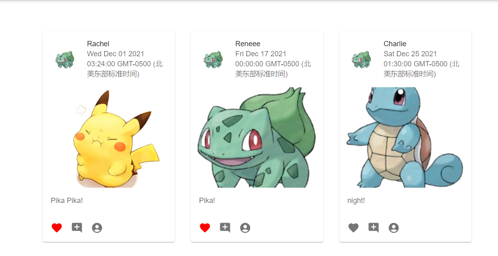

### Comment on posts
Users can add, edit and delete comments on posts, after adding/ editing comments, press enter to save the operation and go back.

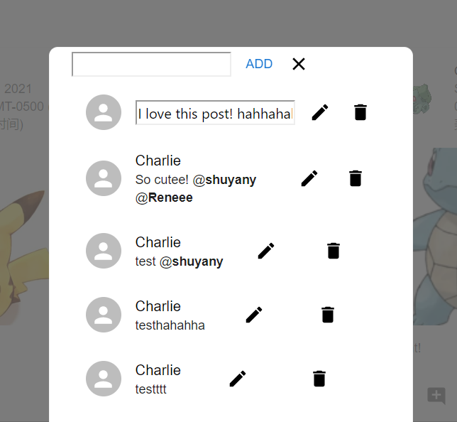

### Editing/Deleting posts and comments

The buttons on the bottom of post from left to right are like/unlike button, edit post button, add/edit/delete comments button, tagged people button and delete post button.

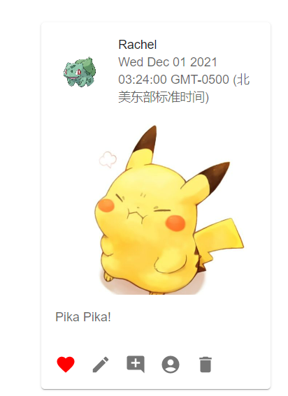

User can edit posts by clicking the second button from left.

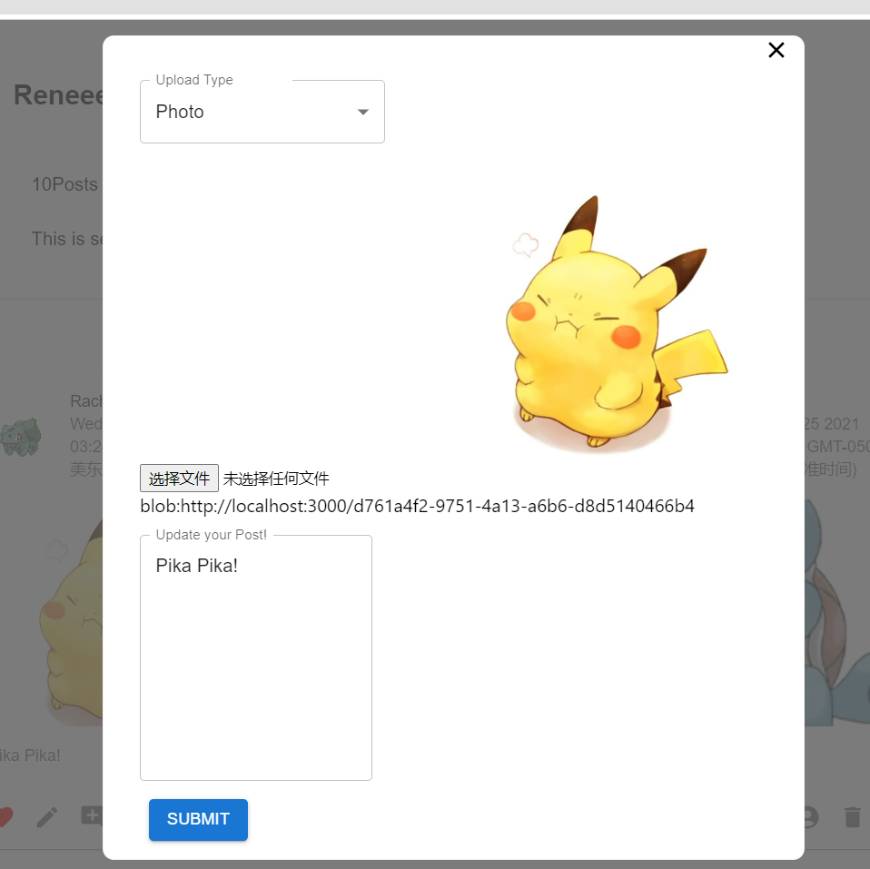

User can delete posts by clicking the rightmost button.

User can edit or delete comments by clicking the button in the middle.

### Follower suggestions

Users can see their follower suggestions by clicking follows, the follower suggestions is on the top.

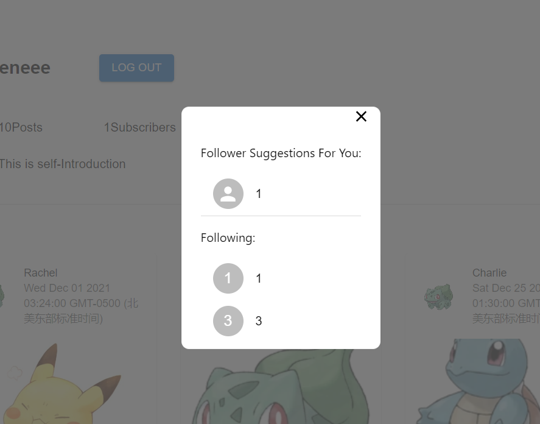

### Tagging photos and  @mentions in comments
Users can tag people on photos, and tagged people can be reviewed on the rightmost button on the bottom of post on home page.

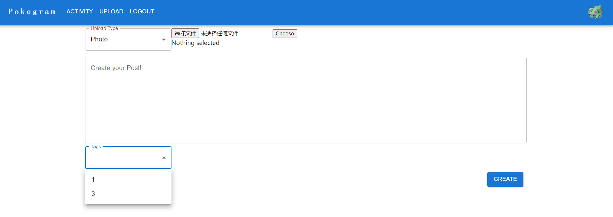

Users can also mention people on the comment by starting typing @.

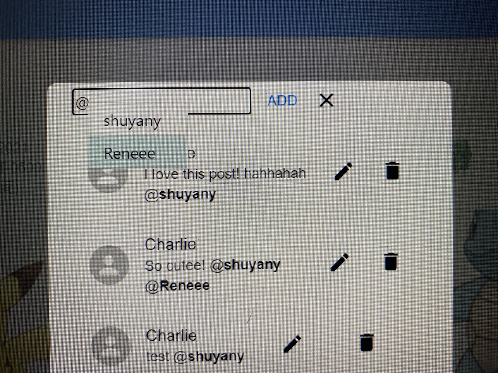

## How to Run Locally
- Download the project
- To start the backend service, cd into server directory (we put all the backend related services there) and run `npm install` to download the dependencies needed and then run  `npm start` to start the backend service
- cd into pokegram directory by using `cd pokegram` and run `npm install` to download dependencies needed (you should have node, npm installed on your local machine). And then run `npm start` to start the frontend view
- We use `jest` for backend testing and please cd into the backend directory and run `npm test` to get the test rsult (we also attach the screenshot of our coverage in wiki page).

## Login Information
- Please try with username `test1` and password `password` for test purpose
- or you can choose to sign up a new user and login with corresponding username and password

### running `json-server`
cd ..
json-server --watch db.json --port 8000

### running `jest` (if jest not found)
npm install -g jest-cli

